# Tensorflow Implementation of YOLOv3

Download weights in the repo containing files
```bash 
$ wget https://pjreddie.com/media/files/yolov3.weights
```
## Usage
```bash
$ python3 main.py 
```
In order to use the model on custom images add them into images directory

> **_NOTE:_** on Colab Notebook use following command:
```python
!wget https://pjreddie.com/media/files/yolov3.weights
!python main.py
```
## Contributed by:
* [Antreev Singh Brar](https://github.com/antreev-brar)
## References

* **Title**: YOLOv3: An Incremental Improvement
* **Authors**: Joseph Redmon, Ali Farhadi
* **Link**: https://arxiv.org/abs/1804.02767v1
* **Tags**: Neural Network
* **Year**: 2018

# Summary

## Why new Model(Drawbacks of YOLOv1 and YOLOv2)

* YOLOv1 imposes strong spatial constraints on bounding box predictions since each grid cell only predicts two boxes and can only have one class. This spatial constraint limits the number of nearby objects that our model can predict. Model struggles with small objects that appear in groups, such as flocks of birds. Since the model learns to predict bounding boxes from data, it struggles to generalize to objects in new or unusual aspect ratios or configurations.  Model also uses relatively coarse features for predicting bounding boxes since their architecture has multiple downsampling layers from the input image. Finally, while  train on a loss function that approximates detection performance, their loss function treats errors the same in small bounding boxes versus large bounding boxes. A small error in a large box is generally benign but a small error in a small box has a much greater effect on IOU. The main source of error is incorrect localizations
* YOLO v2 used a custom deep architecture darknet-19, an originally 19-layer network supplemented with 11 more layers for object detection. With a 30-layer architecture, YOLO v2 often struggled with small object detections. This was attributed to loss of fine-grained features as the layers downsampled the input.YOLO v2’s architecture was still lacking some of the most important elements that are now staple in most of state-of-the art algorithms. No residual blocks, no skip connections and no upsampling. YOLO v2 used softmax for class prediction which isn't the most suitable choice .
## Introduction 
Main purpose of a object detector is to be fast and accurate and able to recognize wide dataset.


## Key features of YOLOv3
### Bounding Box
 - It is same as that used in Previous versions . Cordinates are predicted and sum of squared error loss is used while training
- Objectness score is predicted using logistic regression

### Class Prediction
- Softmax is not used.
- Independent logistic classifiers are used and binary cross-entropy loss is used

### Prediction on different scales
- As my personal opinion it is the best feature of YOLOv3 , it predicts bounding boxes on 3 different scales for detection on different scales . Previous versions used just one .
- k-means clustering is used here as well to find better bounding box prior but this version used predefined anchor box dimensions.
- Darknet - 53 feature extractor is used which is much deeper than Darknet- 19 used in YOLO v2


### Model Summary
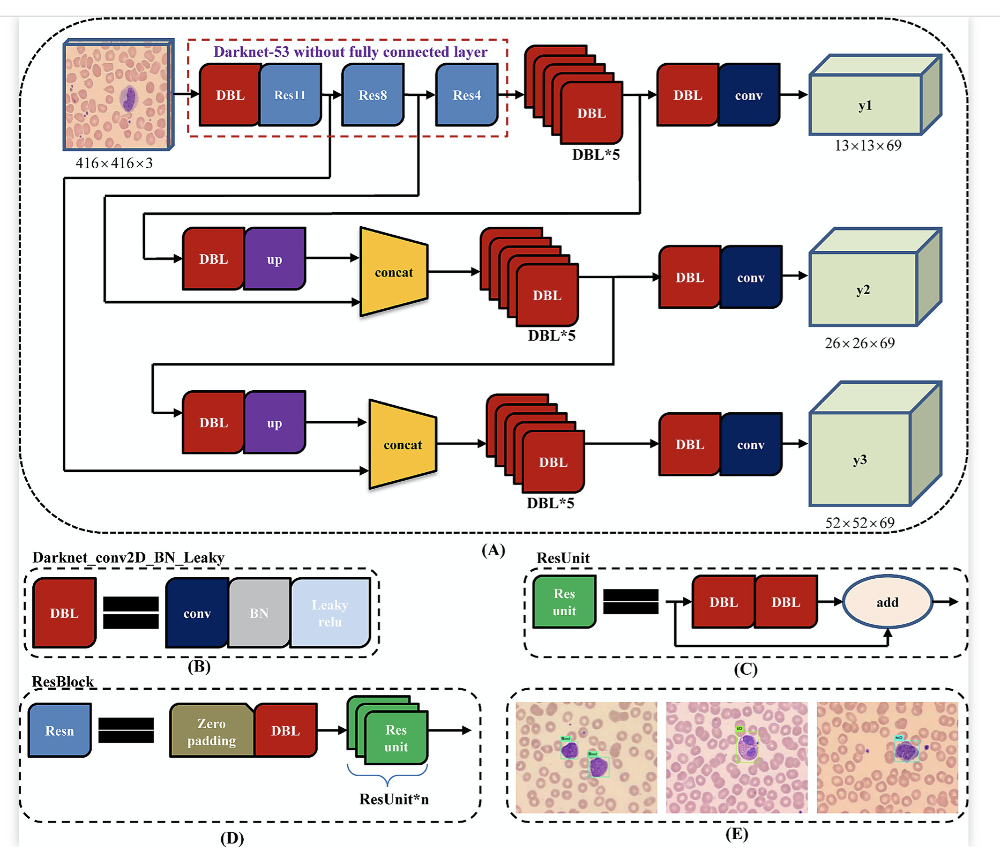
```
Total params: 62,001,757
Trainable params: 61,949,149
Non-trainable params: 52,608
```
I used yolov3 pretrained on MSCOCO dataset

## What happens in the Background 
#### I wanna use this part of summary to take you through a journey as from the perspective on an image on how predictions are made.
 - We build a model as per the architecture defined above and load it weights which were trained on MSCOCO dataset that has 80 classes.
 - Now you have to define anchor box dimensions ,will explain later what it means but there are two ways to do it . Run k-means clustering algorithm through your image dataset to find best anchor dimensions or set them manually.
##### We are ready to start image processing now .

YOLOv3 needs that all images that enter the neural net should have dimensions of (416 * 416) . So we need to change dimensions of image to the ones required.Further we need to set one more value that is class_threshold . 

The best way to see it is , you are telling the model about the minimum value that a class prediction should have to be considered as a true prediction . For eg lets say if model thinks that the figure enclosed in a bounding box is [53% human , 10 % car , 10% tree ..] (rest of the values dont matter as we deal only with maximum) and we have set class threshold at 0.5 then it will consider that it is a human and will show it as an output , if it were higher like 0.6 then this prediction would be rejected.


##### Lets make predictions 

- We pass the image of shape (416,416,3) into the neural architecture then it makes ((13 * 13 )+(26 * 26) +(52 * 52) * 3 * 3) predictions . As for each cell on each scales it makes 3 bounding box predictions and for each box we have 3 anchor boxes so total 9 . 
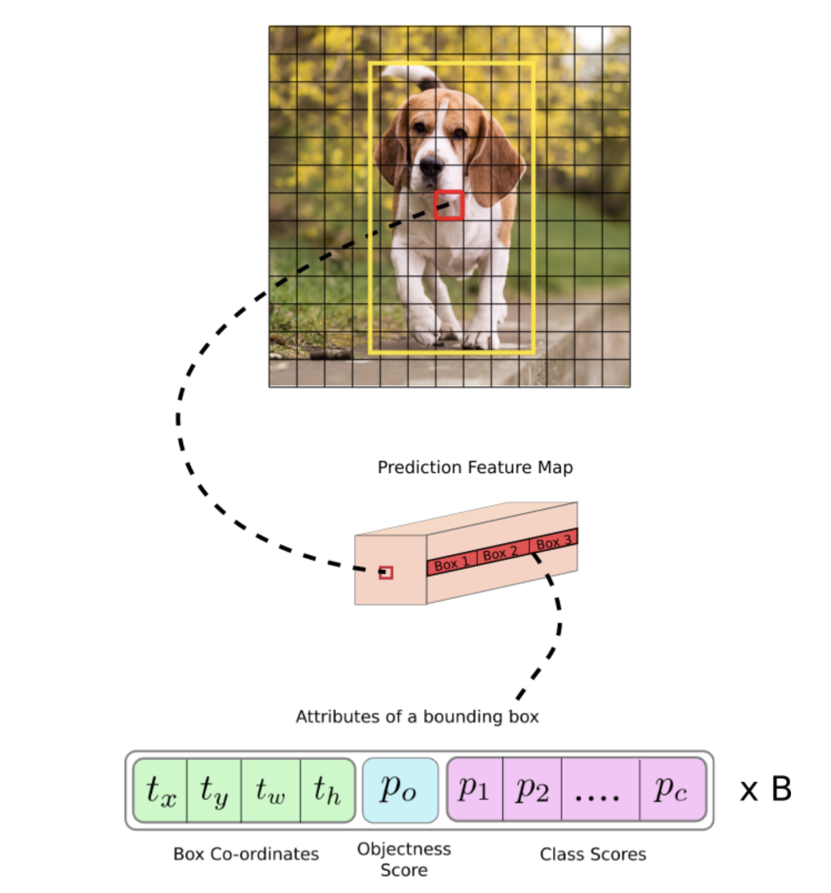

- Look at the architecture the ouput seems to be three 3D arrays of shape (13,13,69) , (26,26,69) ,(52,52,69) . Here in our case the number is 255 , but the 13,26,52 are fixed as they describe that u divided the image into 13 * 13 cells and then made predictions on them , likewise for 26 and 52.

```
this is almost correct but we have 3 bounding boxes instead of 5
```
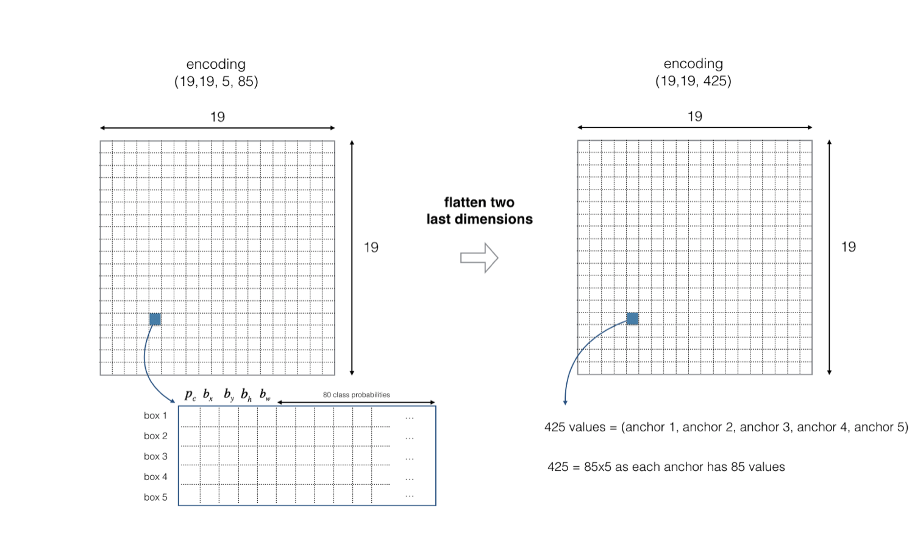

- Lets have a look on the 255 number itself it is 3 * 85 , 3 being the number of boxes predicted for each cell and 85 comes from 5 + number_of_classes (i.e 80 ) .This is all the information u need to make a predication . The 5 values in the begining are :
* tx -(range : 0-1) will give us X cordinate of the centre of box after  operation;  
* ty -(range : 0-1) will give us Y cordinate of the centre of box after an operation;
* th -(range : 0-1) will give us height of box after an operation;
* tw -(range : 0-1) will give us width of box after an operation;
* p -(range : 0-1) probability of having any object at all in the cell


The operations are :


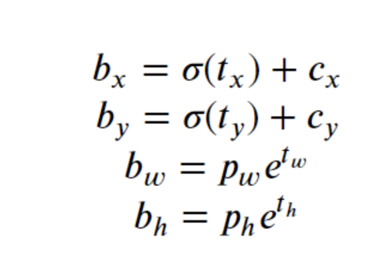
```
I know u have no idea what these operations mean :
𝑐𝑥 and 𝑐𝑦 are the top-left coordinates of the grid. 𝑝𝑤 and 𝑝ℎ are anchors dimensions for the box.
The main thing is after these operations we get all the four cordinates of a prediction box with respect to image 
If top-left corner is (0,0) and bottom right is (1,1) . This will be helpful in drawing box on orginal image , not the processed (416,416) one , pretty dope right !!
```
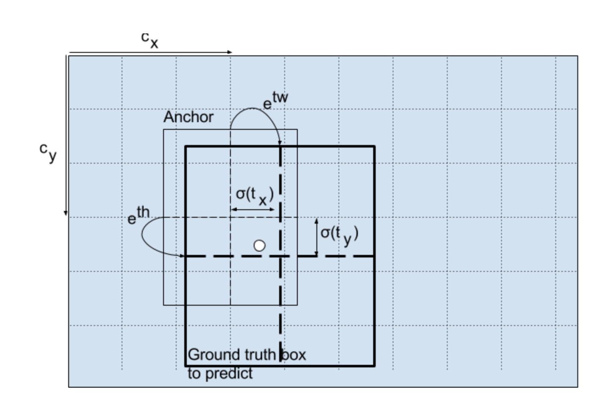

 Now we have the boxes but we dont know if which object is in there (if any ) , So here is what we do , we multiply probability of any object in the cell to the class values. This gives a number that would be a measure what is the chance that there is an object in the box && the object is of a particular class.
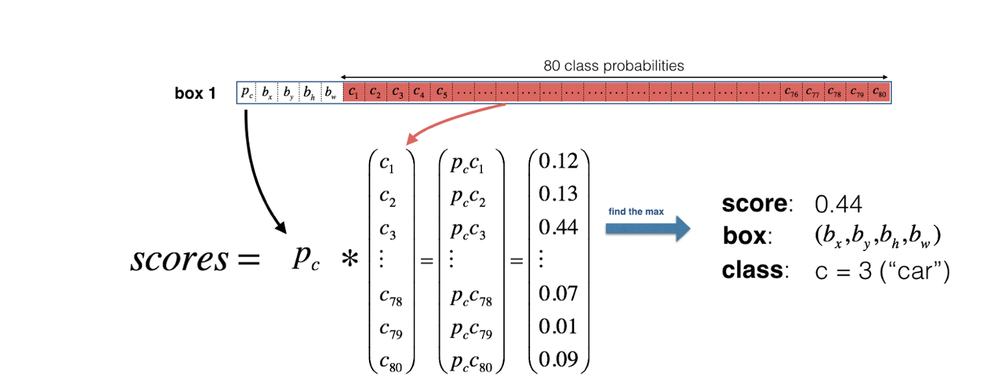

- Now half the job is done, u take the maximum value among all classes and if that exceeds class threshold , add it to list of possible boxes ,( :) possible bcz we still got some job to do).

- Note that the multiple boxes can enclose an image or a part of an image , so we need a method to check if the box is the best possible . We do this by IOU (Intersection over Union ) , just :
For the best possible fit this would be 1 , we choose another number to set as a threshold to remove arbitrary boxes.
**IOU = intersection area / union area**
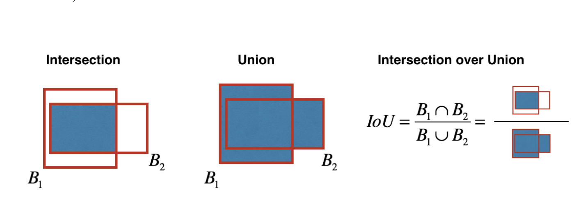
- Still there can be more than one box surrounding an object , we do **nms** here namely (Non-maximum supression) , as the name suggest for a particular class all boxes that don't have maximum chance of enclosing an object && overlap with the box (having maximum chance) are supressed . We use IOU index again to check overlap , and if it is greater than 0.5 (set manually)
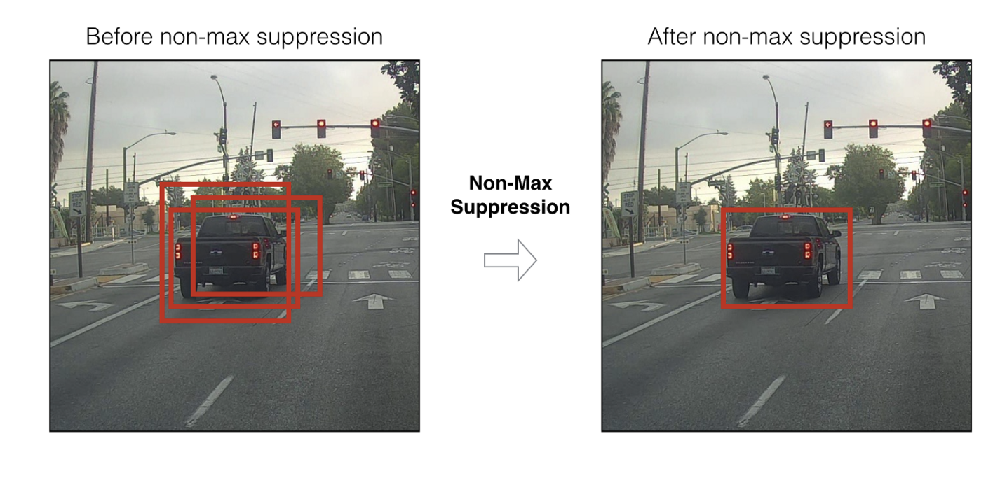
Congratulations u made it this far - Now u have all the boxes u want in final output , just draw on them on image u need and u have the result :)

PS :- I have uploaded the whole yolov3 notebook that i used to make video .You can copy the contents and run it in colab to generate ur own.
# Results

## Images
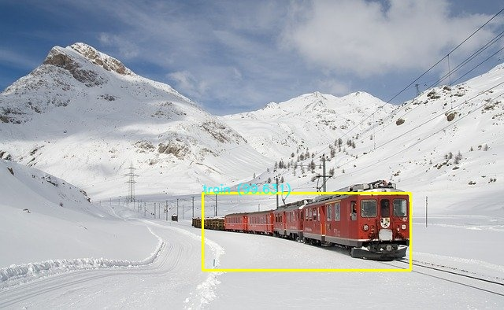
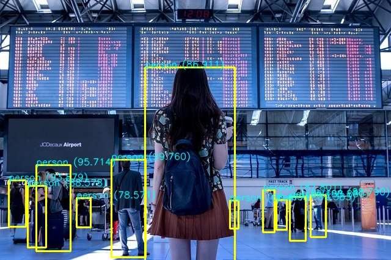
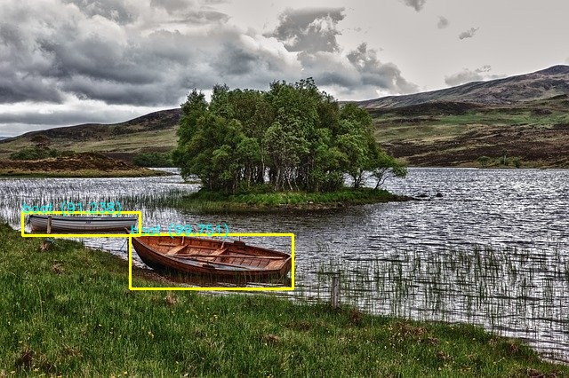
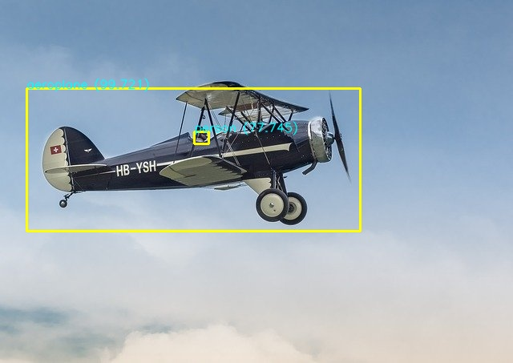
